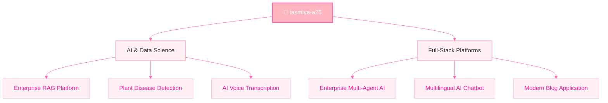

<!-- HEADER -->
<div align="center">
  
</div>

<div align="center">
  
</div>

<br>

<!-- PROFILE & TERMINAL (PERFECT RESPONSIVE ALIGNMENT) -->
<div align="center">
  
  <br>
  <b>tasmiya-a25</b> • <i>she/her</i>
  <br><br>
  <a href="https://github.com/tasmiya-a25"></a>
  <a href="#"></a>
</div>

<br>

<div align="center">
  <h3>💻 tasmiya@aesthetic-macbook:~$</h3>
</div>

```json
{
  "user": "Tasmiya A",
  "role": "AI Engineer & Full-Stack Developer",
  "focus": ["Building smart apps", "Designing aesthetic systems"],
  "stack": ["Python", "Django", "FastAPI", "React", "Docker"],
  "ai_ml": ["NLP", "Deep Learning", "LangGraph", "LLMs"],
  "status": "Ready to collaborate ✨"
}
```

<h3 align="center">💖 Tech Stack</h3>
<p align="center">
  
</p>

<br>

---

<br>

<!-- SYSTEM BLUEPRINT -->
<h2 align="center">🦋 Holographic System Blueprint 🦋</h2>
<p align="center"><i>Interactive architecture of featured projects</i></p>



<br>

---

<br>

<!-- FEATURED PROJECTS GITHUB CARDS -->
<h2 align="center">🎀 Featured Repositories 🎀</h2>
<p align="center">
  <a href="https://github.com/tasmiya-a25/enterprise-multi-agent-ai-platform">
    
  </a>
  &nbsp;&nbsp;&nbsp;
  <a href="https://github.com/tasmiya-a25/Enterprise-RAG-Knowledge-Platform">
    
  </a>
</p>
<p align="center">
  <a href="https://github.com/tasmiya-a25/Multilingual-AI-Chatbot">
    
  </a>
  &nbsp;&nbsp;&nbsp;
  <a href="https://github.com/tasmiya-a25/Plant-Disease-Detection">
    
  </a>
</p>

<br>

---

<br>

<!-- GITHUB ANALYTICS -->
<h2 align="center">📊 GitHub Analytics</h2>

<p align="center">
  
  &nbsp;&nbsp;&nbsp;
  
</p>
<p align="center">
  
</p>

<br>

<!-- FOOTER -->
<div align="center">
  
</div>
